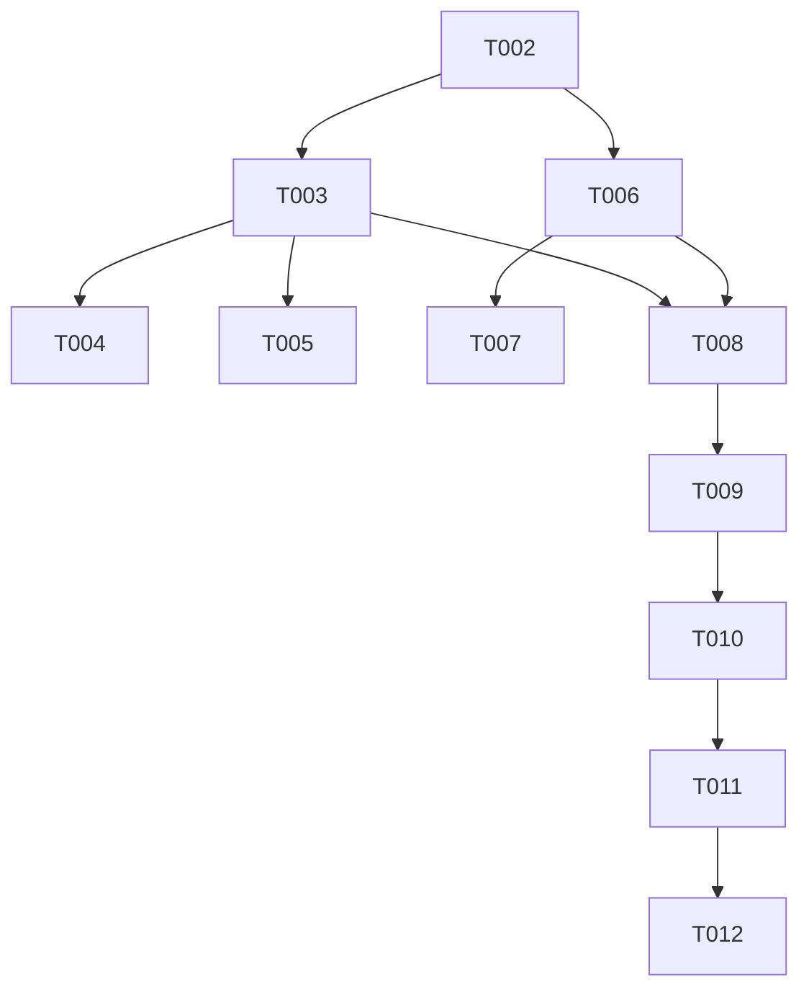

# Tasks: Seed Data & Cleanup System

**Feature**: `seed-data-cleanup`
**Plan**: [implementation_plan.md](file:///C:/Users/NumanSh/.gemini/antigravity/brain/7f67a5ce-90fa-4c08-ab54-cde75c09242a/implementation_plan.md)

## Phase 1: Setup
- [x] T001 Initialize the task tracking system in `specs/17-seed-data-cleanup/tasks.md`

## Phase 2: Foundational
- [x] T002 [P] Create the `SeedService` skeleton in `lib/core/services/seed_service.dart`

## Phase 3: Seed Data Generation [US1]
- [x] T003 [US1] Implement `seedData()` using `WriteBatch` to populate Users, Pets, and Bookings
- [x] T004 [P] [US1] Define curated Hebrew bios and pet names in `SeedService`
- [x] T005 [P] [US1] Define curated Hebrew reviews and ratings in `SeedService`

## Phase 4: Cleanup Utility [US2]
- [x] T006 [US2] Implement `clearMockData()` with recursive batch delete logic
- [x] T007 [US2] Implement safety filters for `@demo.petpal.com` and `isMock` flag

## Phase 5: UI Integration [US3]
- [x] T008 [US3] Add "Seed" and "Clear" action buttons to the `ProfileScreen` header
- [x] T009 [US3] Implement premium confirmation dialogs using `AppDialog`
- [x] T010 [US3] Connect UI actions to `SeedService` with loading feedback

## Phase 6: Polish & Final Review
- [x] T011 [P] Localize all system feedback messages to Hebrew
- [x] T012 [P] Perform final safety audit of the deletion logic

## Dependency Graph

## Parallel Opportunities
- T004 and T005 (Data curation)
- T011 and T012 (Polishing)
- T002 (Skeleton) can be started immediately.
